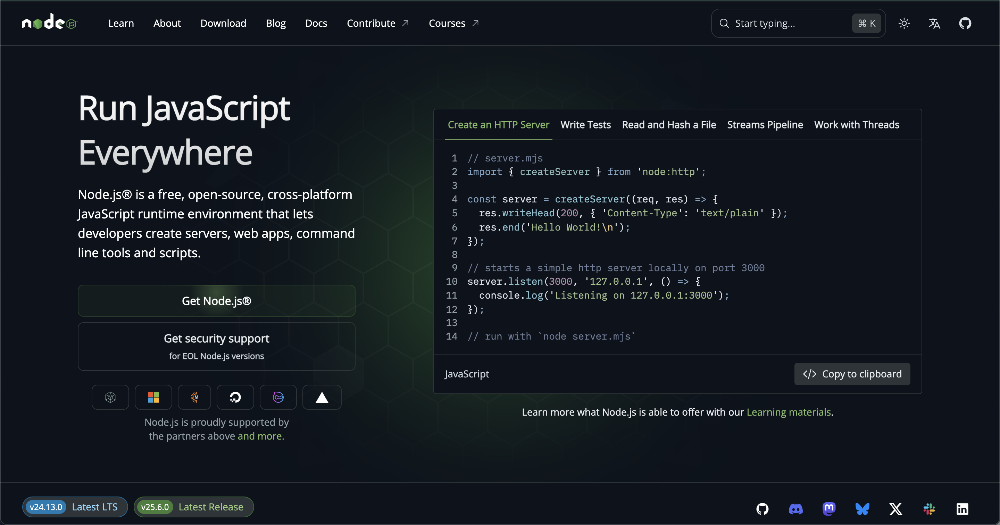
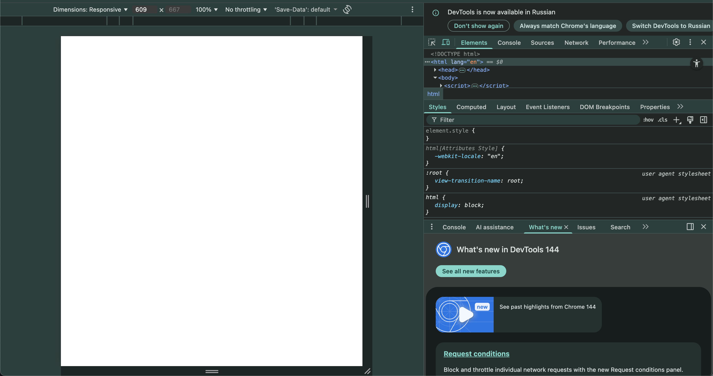
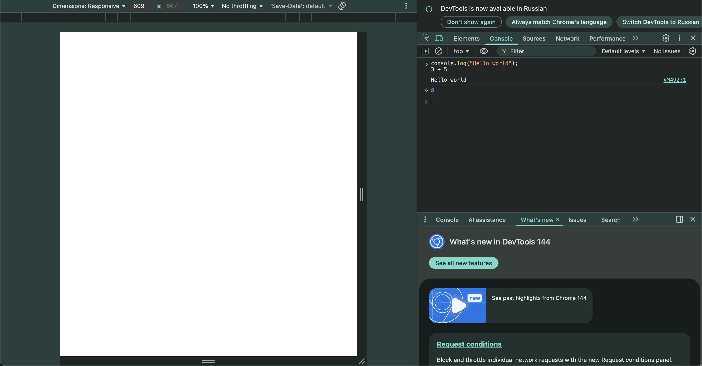
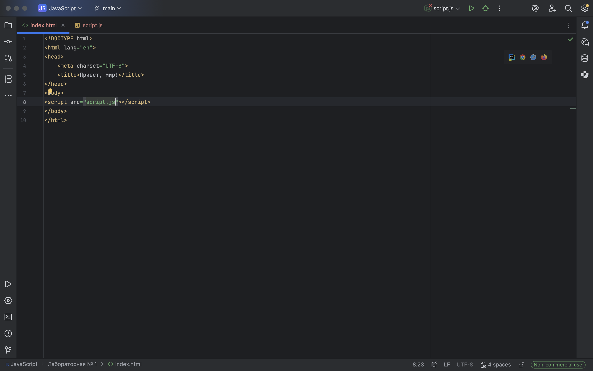
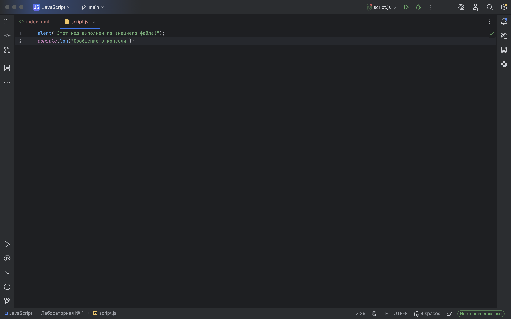
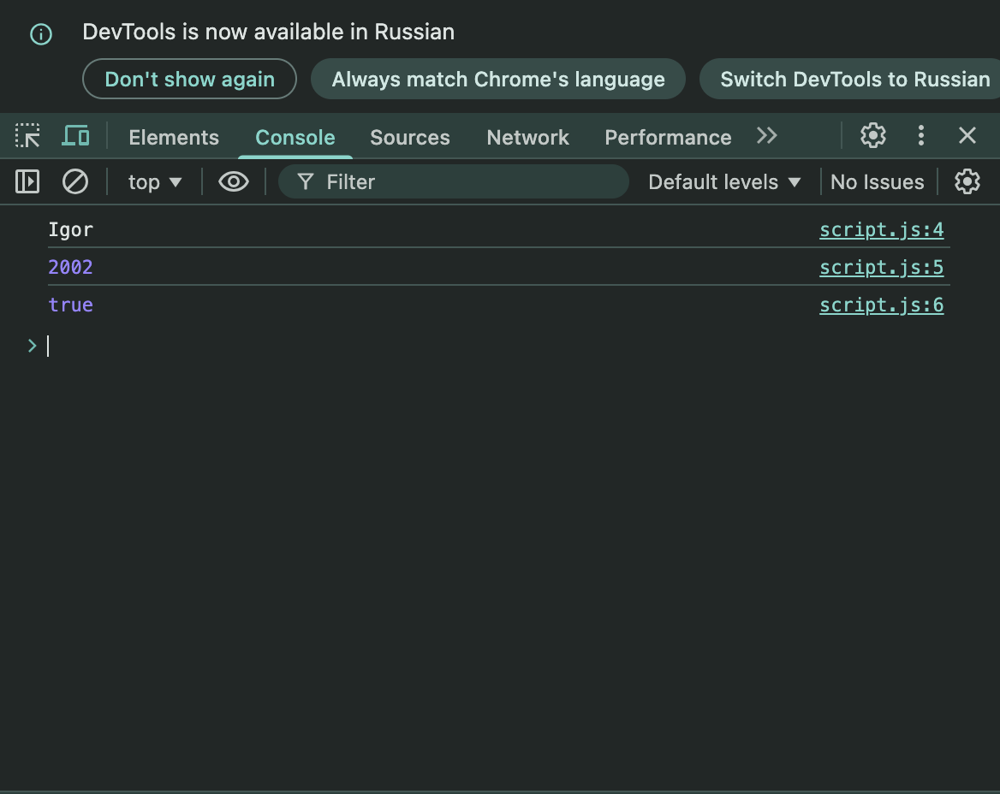
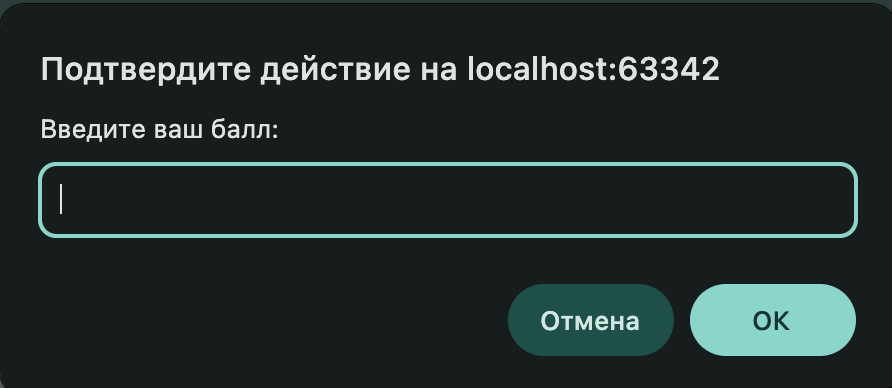

# *Лабораторная работа № 1*

## Задание 1. Выполнение кода в браузере
### 1. Подготовка среды:
* Для выполнения лабораторных работ скачиваем IDE от JetBrains — [WebStorm](https://www.jetbrains.com/ru-ru/webstorm/) с официального сайта.


* Также для локального выполнения кода JavaScript устанавливаем [NodeJS](https://nodejs.org/en) с официального сайта.


* Открытие консоли как инструмента разработчика на F12.


### 2. Выполнение кода JavaScript в браузере:
* Открываем консоль разработчика в инструментах разработчика, в моем случае это Google Chrome и наблюдаем результат работы команд:

`console.log("Hello World")` и `2 + 3`, наблюдаем, что первая команда вывела нам строку "Hello World", а 2 + 3 вернуло нам значение 5.



### 3. Создаем файл HTML фактом под названием index.html со следующим содержимым: 
``` html
<!DOCTYPE html>
<html lang="en">
<head>
    <meta charset="UTF-8">
    <title>Привет, мир!</title>
</head>
<body>
<script>
    alert("Привет, мир!");
    console.log("Hello, console!");
</script>
</body>
</html>
```
После чего видим модальное окно с текстом "Привет, мир!", закрыв которое можем наблюдать текст в консоли "Hello World", отображающийся после закрытия модального окна.

### 4. Подключаем внешний JS-файл добавив в него код:
``` javascript
alert("Этот код выполнен из внешнего файла!");
console.log("Сообщение в консоли");
```



## Задание 2. Работа с типами данных
### 1. Объявление переменных и работа с типами данных.
Объявляем переменные:
``` javascript
let name = "Igor";
let birthYear = 2002;
let isStudent = true;
```
Затем путем `console.log()` для каждой переменной выводим их содержимое и видим следующее в консоли, теперь наш код выглядит следующим образом:

``` javascript
let name = "Igor";
let birthYear = 2002;
let isStudent = true;
console.log(name);
console.log(birthYear);
console.log(isStudent);
```
Вывод в консоли выглядит следующим образом:

### 2. Управление потоком выполнения (условия и циклы)
* Добавляем следующий код в script.js: 
```javascript
let score = prompt("Введите ваш балл:");
if (score >= 90) {
 console.log("Отлично!");
} else if (score >= 70) {
 console.log("Хорошо");
} else {
 console.log("Можно лучше!");
}

for (let i = 1; i <= 5; i++) {
 console.log(`Итерация: ${i}`);
}
```

и при запуске index.html наблюдаем модальное окно, в котором можем вести значение, я же введу значение 30, данное значение будет типа String, но в результате приравнивания оно будет неявно преобразовано в тип Number и затем будет выведено:
``` javascript
Igor
2002
true
Можно лучше!
Итерация: 1
Итерация: 2
Итерация: 3
Итерация: 4
Итерация: 5
```



# **Контрольные вопросы**
### 1. Чем отличается var от let и const?
* var является старым видом объявления переменной с глобальной областью видимости, который был актуален до появления стандарта ES6 добавляющий объявление переменных let и const, имеющих блочную облавсть видимости, но отличительная особенность является то, что const переменная после объявления будет неизменной. 
* При объявлении и инициализации переменной var в каком-то блоке кода, данная переменная будет доступна и вне данного блока, что иногда может привести к непредвиденному изменению, когда как let и const имеет область видимости в пределах объявленного блока.
* Одной интересной особенностью является то, что при работе с переменной var до ее объявления, она будет типа undefined, когда как при let и const возникнет ошибка ReferenceError, которая не предоставляет доступ к переменной до ее инициализации.
### 2. Что такое неявное преобразование типов в JavaScript?
Неявное преобразование типов в JavaScript это особенность языка, при которой один тип данных может преобразоваться в другой тип без его ручного изменения, например в случаях:
```javascript
"2" + 3
"6" == 6
2 >= "3"
true > 1
false == 0
false || 1
true && "hello"
"2" * 3
"10" / 2
```
То есть при операциях сложения происходит неявного преобразование типа Number в String за счет операнда + происходит конкатенация строк при логических операциях >, <, >=, <=, == происходит неявное преобразование типов, а также при логических контекстах - if, while, switch, при арифметических операторах `-, /, %, *` происходит неявное преобразование 
### 3. Как работает оператор == в сравнении с ===?
Оператор == является оператором не строго равенства, который сравнивает значения без их привдения типов, то есть в случае если значения сравнивающихся значений будет одинаковых, а их тип разный, то в таком случае будет считаться что значения равны, когда как === является приравниванием с строгим приведением типов, где равные значения с разными типами данных не будут равны друг другу.
